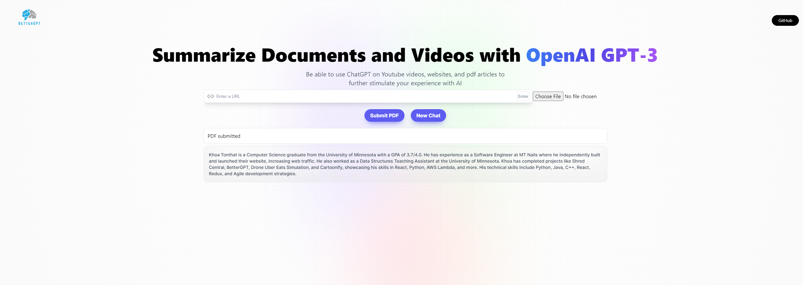

# Better-GPT

This project is a Flask application that uses the GPT-3 model from OpenAI to generate responses based on user input or upload.


# Live Demo

Live: https://better-gpt-g45c.onrender.com/



## Getting Started

These instructions will get you a copy of the project up and running on your local machine for development and testing purposes.

### Prerequisites

You need to have Python installed on your machine. You can download Python [here](https://www.python.org/downloads/).

### Installing

1. Clone the repository:

```bash
git clone https://github.com/NotKhoa03/Better-GPT.git
```
2. Navigate into the cloned repository

```bash
cd Better-GPT
```

3. Run the necessary build command

```bash
npm run build
```

### Running the Application

4. The run command has been scripted into
```bash
npm run start
```

# Contributing
Contributions are welcome. Please feel free to submit a pull request or open an issue.

# License
This project is licensed under the MIT License - see the LICENSE.md file for details

# Contact
For any questions or concerns, please open an issue on GitHub.